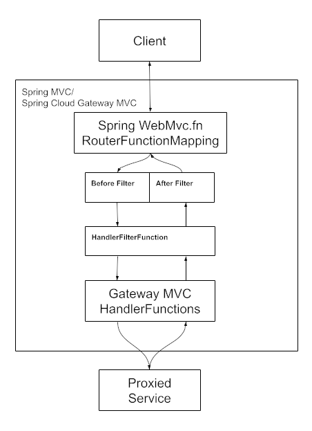

# Getting Started
API Gateway is a Spring Boot application that serves as a single entry point for all e_motion applications. It is built using Java and Maven for dependency management.

### Reference Documentation
For further reference, please consider the following sections:

* [Spring Boot Actuator](https://docs.spring.io/spring-boot/3.4.2/reference/actuator/index.html)
* [Gateway](https://docs.spring.io/spring-cloud-gateway/reference/spring-cloud-gateway-server-mvc.html)

### Guides
The following guides illustrate how to use some features concretely:

* [Building a RESTful Web Service with Spring Boot Actuator](https://spring.io/guides/gs/actuator-service/)

